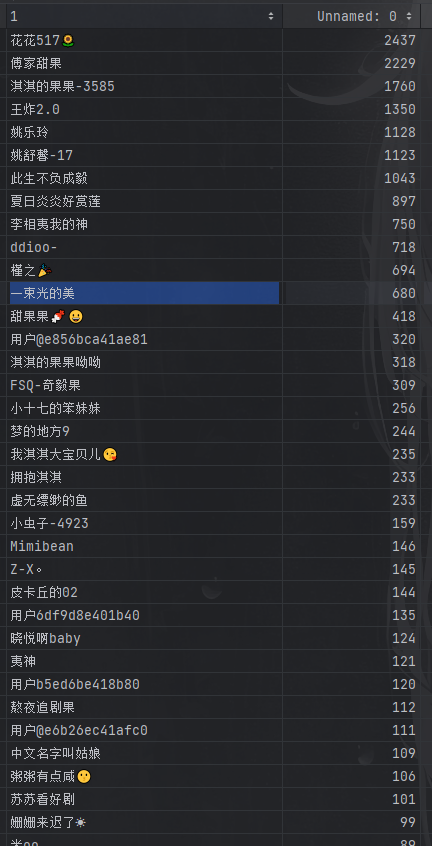

# 2023-TV-series-data-analysis

云顶书院人工智能方向大一研学收尾项目，是大一所学习内容的总结，爬取中国各个主流网站的电视剧数据进行数据分析，分析其中规律

#### 环境准备

- python 3.11
- pandas==2.0.3
- numpy==1.24.3
- matplotlib==3.7.1
- requests==2.28.1
- beautifulsoup4==4.11.1

#### 运行

1. 克隆代码到本地

   ```
   git clone https://github.com/sizhouLiu/2023-TV-series-data-analysis.git

   ```

2. 安装依赖

   ```
   pip install -r requriements.txt
   ```

3. 找到需要的函数运行

#### 数据分析

为量化分析2023年电视剧评分，采用层次分析法，利用爬虫收集参与制作演员导演数量、评论数、点赞数、收藏数、电视剧总时长作为分析数据。

同时，为具体量化对比，选取电视剧评分最高的《红楼梦》作为标准，收集其数据作为对比。

模型假设

（1）所有评论评分均出自现实用户之手，并非人为刷分

（2）所有用户评价分析独立，不受他人影响

模型建立与求解

为综合考量多方面数据以及对其可量化处理，本文采用层次分析模型对每个变量的权重进行处理求解。层次分析法定权更为准确，适用于本题。

考量因素如下表展示

| 目标层                         | 准则层                                   |
| ------------------------------ | ---------------------------------------- |
| 电视剧评分 S                   | 演员阵容 A（参与电视剧制作主要成员人数） |
| 总时长 B（集数乘以单集时长）   | 总时长 B                                 |
| 评论数 C（总讨论数）           | 评论数 C                                 |
| 点赞数 D（用户对电视剧点赞数） | 点赞数 D                                 |
| 收藏数 E（用户对电视剧收藏数） | 收藏数 E                                 |

 

演员阵容为参与电视剧制作主要成员人数，主要成员人数越多，制作会较为精良。

总时长代表的电视剧剧情丰富程度，在一定程度上，剧情时长越长，剧情越丰富，同时对用户而言观感越好。

评论数代表用户对剧情讨论的程度，即讨论越多，剧情以及电视剧讨论程度越高，热度越高；但评论中也可能存在差评，因此重要程度一般。

点赞数代表用户对电视剧的认可程度，同时，因为点赞较为方便，在一定程度上也反映了实际观看用户人数以及不立刻退出的用户人数。

收藏数反映了用户对于电视剧的认可程度以及再次观看的可能性，反映了用户黏度，相对比较重要。

判断矩阵

|          | 时长 | 热度 | 演员阵容 | 评分 | 评论数 |
| -------- | ---- | ---- | -------- | ---- | ------ |
| 时长     | 1    | 1/5  | 1/2      | 1/3  | 1/4    |
| 热度     | 5    | 1    | 2        | 1/2  | 1/2    |
| 演员阵容 | 2    | 1/2  | 1        | 2    | 1/2    |
| 评分     | 3    | 1/2  | 1/2      | 1    | 1      |
| 评论数   | 4    | 2    | 2        | 1    | 1      |

对判断矩阵一致性检验：

计算一致性指标CI：


对每部电视剧进行归一化处理，可得每部电视剧的各项成绩

在进行数据处理时发现了一些及其离谱的离群值


爬取部分评论后发现



将评论大于10条的用户洗掉后，两万五千条数据大约有2000是正常用户所评论

去除离群值后分析得图表


由于不能很好的剔除刷的数据所以分析出的结论仅供参考
